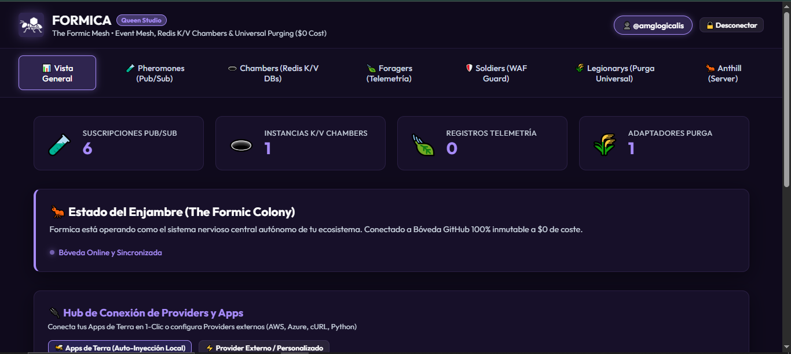

<div align="center">
  
  <h1>🐜 FORMICA</h1>
  <p><strong>The Formic Mesh — $0 Cost Infrastructure for the Terra Ecosystem</strong></p>
  <p>
    <a href="https://www.npmjs.com/package/terra-formica"></a>
    <a href="https://www.npmjs.com/package/terra-formica"></a>
    
    
    
    
  </p>

  <p>
    <a href="https://amglogicalis.github.io/Formica/" target="_blank">
      
    </a>
  </p>

  <br/>

  <a href="https://amglogicalis.github.io/Formica/" target="_blank">
    
  </a>
  
  <p><em>Formica Queen Studio — Visual Control Panel for your entire colony</em></p>
</div>

---

## What is Formica?

**Formica** is a **zero-cost, serverless infrastructure mesh** built on top of **GitHub's API and GitHub Actions**. It provides five production-grade services in a single npm package:

| Module | Description |
|--------|-------------|
| 🧪 **Pheromones** | Event Mesh & Pub/Sub system — publish events across apps |
| 🕳️ **Chambers** | Distributed Redis-like K/V cache with TTL support |
| 🍃 **Foragers** | Structured telemetry & logging aggregator |
| 🛡️ **Soldiers** | WAF (Web Application Firewall) with priority rules |
| ⚔️ **Legionarys** | Universal Purge Engine & modular garbage collector |
| 🔌 **Providers Hub** | Central hub to connect any app or cloud provider |
| 🐜 **Anthill** | Self-hosted event processing server on GitHub Actions |

> **The trick**: Formica uses a private GitHub repo (`.formica-storage`) as a persistent JSON database, and a public GitHub repo (`formica-anthill`) as a serverless event processor — all with **$0 cost** and **no infrastructure**.

---

## Quick Start

### Install

```bash
# Install globally (CLI + local web console)
npm install -g terra-formica

# Or install as a project dependency (SDK only)
npm install terra-formica
```

### Launch Queen Studio (Web Console)

```bash
# Start the visual control panel locally
formica studio

# Custom port
formica studio --port 4000
```

Open **http://localhost:3740**, connect with your GitHub Personal Access Token (PAT) and your entire colony is at your fingertips.

### Or use the Live Online Console

➡️ **[https://amglogicalis.github.io/Formica/](https://amglogicalis.github.io/Formica/)**

---

## How it Works

```
┌─────────────────────────────────────────────────────────────────────┐
│                    YOUR APPLICATIONS                                │
│  Terra Apps: Sinchlor · Lumina · Ballom · Rolla · Webbl · Termes  │
│           + Any external app (AWS Lambda, Python, etc.)            │
└────────────────────────┬────────────────────────────────────────────┘
                         │ formica.publishEvent() / formica.log()
                         ▼
┌─────────────────────────────────────────────────────────────────────┐
│                 FORMICA SDK / CLI                                    │
│  🧪 Pheromones  🕳️ Chambers  🍃 Foragers  🛡️ Soldiers  ⚔️ Legionarys │
└────────────────────────┬────────────────────────────────────────────┘
                         │ Persists to GitHub API
         ┌───────────────┼───────────────────────┐
         ▼               ▼                       ▼
┌────────────────┐ ┌──────────────────┐ ┌────────────────────────┐
│ .formica-      │ │ formica-anthill  │ │ Queen Studio           │
│ storage repo   │ │ (GitHub Actions) │ │ (Web Console)          │
│ (State DB)     │ │ Event Processor  │ │ amglogicalis.github.io │
└────────────────┘ └──────────────────┘ └────────────────────────┘
```

**Storage**: Your state (subscriptions, K/V data, WAF rules, logs) lives in a private repo `<your-username>/.formica-storage` as a JSON file.

**Anthill**: When Formica needs to dispatch webhooks, process events in background, or wake on inbound triggers — it fires a GitHub `repository_dispatch` event that starts a GitHub Actions workflow. The workflow runs Node.js to process the event queue, then goes back to sleep (auto-sleep after 10 min idle). **100% free** for public repos.

---

## Authentication

All Formica operations require a **GitHub Personal Access Token (PAT)** with `repo` scope.

**Generate one at**: https://github.com/settings/tokens → `repo` scope checked.

```bash
# Set token as environment variable (recommended)
export GITHUB_TOKEN=ghp_your_token_here

# Or pass inline on any command
formica status --token ghp_your_token_here
```

---

## CLI Reference

All CLI commands accept `--token <ghp_...>` and `--vault <id>` (optional; defaults to `default-colony`).

### ⚙️ General

```bash
formica version                  # Show CLI version
formica status                   # Show colony stats (counts per module)
formica studio [--port 3740]    # Launch Queen Studio locally
```

**Example:**
```bash
$ formica status

🐜 FORMICA :: Colony Status
  🧪 Pheromone Subscriptions : 3
  🕳️  Chamber K/V Databases   : 2
  🍃 Forager Log Entries      : 47
  🛡️  Soldier WAF Rules        : 4
  ⚔️  Legionary Adapters       : 1
  🔌 Connected Providers      : 5
```

---

### 🧪 Pheromones — Event Mesh & Pub/Sub

Pheromones is a **topic-based event bus**. Publishers emit events on topics; subscribers (with optional webhook URLs) receive them.

#### Publish an Event

```bash
formica pub --topic <topic> --message <msg> [--sender <name>] [--payload '{"key":"value"}']
```

```bash
# Simple event
formica pub --topic user.signup --message "New user registered"

# With custom payload
formica pub --topic security.alert --sender Sinchlor --payload '{"userId":"usr_99","level":"critical"}'

# As an alias
formica emit --topic order.placed --payload '{"orderId":"ord_123","total":49.99}'
```

#### Create a Subscription

```bash
formica sub --topic <topic> --name <subscriberName> [--webhook <url>] [--filter <pattern>]
```

```bash
# Internal subscription (logs delivery)
formica sub --topic user.signup --name "Lumina-IAM"

# Webhook subscription (HTTP POST on event)
formica sub --topic security.alert --name "Slack-Notifier" --webhook https://hooks.slack.com/...

# Wildcard — receives ALL events
formica sub --topic "*" --name "AuditLogger"
```

#### List & Delete Subscriptions

```bash
formica sub list                      # List all subscriptions
formica sub del --id <subId>          # Delete a subscription by ID
```

**Topic matching**: The Pheromones engine matches events to subscribers by exact topic string, or the special wildcard `*` which matches all topics.

**Built-in topics**: `security.alert`, `user.signup`, `purge.scheduled`, `log.error_spike`, `chamber.key_expired`

---

### 🕳️ Chambers — Distributed K/V Store

Chambers is a **Redis-like key/value store** backed by GitHub. Supports:
- Simple flat key-value pairs
- Named **Chamber Databases** (grouped multi-key stores)
- **TTL** (time-to-live) expiration
- JSON values

#### Simple K/V Operations

```bash
# Set a value
formica kv set --key <key> --value <value> [--ttl <seconds>] [--namespace <ns>]

# Get a value
formica kv get --key <key>

# Delete a key
formica kv del --key <key>
```

```bash
# Simple string
formica kv set --key jwt_secret --value "my-secret-key"

# JSON value
formica kv set --key user_session --value '{"role":"admin","ip":"10.0.0.1"}' --ttl 3600

# Get value
formica kv get --key user_session
✔ user_session = {"role":"admin","ip":"10.0.0.1"}

# Permanent key (no TTL)
formica kv set --key app_config --value '{"theme":"dark","lang":"es"}'
```

#### Chamber Databases (Multi-Key Redis DB)

For grouping related keys under a named database:

```bash
# Create a named chamber
formica kv create --name "Session Vault" --id sessions --desc "JWT tokens & active sessions"

# Set a key inside the chamber
formica kv set --key token_usr_99 --value '{"role":"admin"}' --ttl 3600 --chamber sessions

# Get from chamber
formica kv get --key token_usr_99 --chamber sessions

# List all chambers (with --verbose for key details)
formica kv list
formica kv list --verbose
```

---

### 🍃 Foragers — Telemetry & Structured Logs

Foragers collects **structured log entries** from any app and centralizes them in your colony, with level filtering, source grouping, and provider-aware stats.

#### Emit a Log

```bash
formica log emit --source <appName> --message <msg> [--level info|warn|error|debug] [--correlation <id>]
```

```bash
# Info log
formica log emit --source Sinchlor --message "User login successful" --level info

# Error log with correlation ID
formica log emit --source Lumina --message "Failed to send email" --level error --correlation req_abc123

# Warning
formica log emit --source "AWS-Lambda" --message "Rate limit approaching (80%)" --level warn
```

#### View Logs

```bash
formica logs              # Last 50 entries
formica logs --limit 200  # Last 200 entries
formica log clear         # Clear all logs
```

**Log levels**: `info`, `warn`, `error`, `debug`

#### From any App (without SDK)

Any service can emit logs directly to Anthill via HTTP:

```bash
curl -X POST https://api.github.com/repos/OWNER/formica-anthill/dispatches \
  -H "Authorization: Bearer YOUR_PAT" \
  -H "Content-Type: application/json" \
  -d '{
    "event_type": "formica-ingest",
    "client_payload": {
      "type": "log",
      "level": "info",
      "source": "my-python-service",
      "message": "Request processed successfully"
    }
  }'
```

---

### 🛡️ Soldiers — WAF Security Gateway

Soldiers is a **Web Application Firewall** with priority-based rules. It protects apps by evaluating incoming requests against configured rules.

**Actions**: `block` (403), `allow` (whitelist bypass), `custom_payload` (custom JSON response)

#### WAF Rules

```bash
# List all WAF rules (sorted by priority)
formica waf list

# Add a rule
formica waf add \
  --name <ruleName> \
  --action <block|allow|custom_payload> \
  [--app <targetApp>]          # '*' = all apps
  [--priority <1-100>]         # Lower = higher priority
  [--path <pattern>]           # Path pattern, e.g. '/api/v1/*'
  [--ip <ipPrefix>]            # IP prefix to match
  [--header <headerName>]      # Header to inspect
  [--header-value <pattern>]   # Header value pattern
  [--status <code>]            # Custom HTTP status (for custom_payload)
  [--payload '{"error":"..."}'] # Custom JSON response payload
  [--ratelimit <req/min>]      # Rate limit threshold

# Delete a rule
formica waf del --id <ruleId>

# Evaluate a mock request against current rules
formica waf check --app Sinchlor --path /api/users --ip 10.0.0.5
```

**Examples:**

```bash
# Block SQLmap User-Agent across all apps
formica waf add --name "Block SQLmap" --action block \
  --header "User-Agent" --header-value "sqlmap" --priority 1

# Whitelist internal subnet
formica waf add --name "Allow Internal Network" --action allow \
  --ip "10.0.0." --priority 1 --app "sinchlor-api"

# Custom JSON error for admin paths
formica waf add --name "Custom Admin Guard" --action custom_payload \
  --path "/admin/*" --app "*" --priority 5 --status 403 \
  --payload '{"error":"Access denied","code":"GUARD_403"}'

# Evaluate request
formica waf check --app "*" --path "/api/users" --ip "192.168.1.50"
✔ Request ALLOWED (Matched rule: 'Allow Internal Network')
```

#### Using WAF in Express (SDK)

```javascript
import { Formica, createExpressWaf } from 'terra-formica';

const formica = new Formica({ githubToken: process.env.FORMICA_PAT });
await formica.init();

// Apply WAF middleware — all requests evaluated against Soldiers rules
app.use(createExpressWaf(formica, { appName: 'my-api' }));
```

---

### ⚔️ Legionarys — Universal Purge Engine

Legionarys is a **modular garbage collector** that identifies and removes stale, expired, or consumed resources across providers. Configured via **Adapters** (named purge jobs with resource groups).

**Adapters** define:
- Which providers to scan (`chambers`, `foragers_logs`, `Sinchlor`, `AWS Lambda`, etc.)
- What filter to apply (`expired_only`, `older_than_30d`, `nectars_consumed`, `level:error`, `*`)
- When to run (`daily_00`, `every_12h`, `every_6h`, `weekly`, `manual`, or a cron expression)
- An optional webhook endpoint to notify on completion

#### Adapter Management

```bash
# List adapters
formica adapter list

# Create an adapter with a resource group
formica adapter add \
  --name "Production Cleaner" \
  --frequency daily_00 \
  --group "Expired Sessions" \
  --provider chambers \
  --filter expired_only

# Advanced: multiple groups via JSON
formica adapter add --name "Full Sweep" --frequency every_12h \
  --groups '[
    {"groupName":"Expired K/V","provider":"chambers","filter":"expired_only"},
    {"groupName":"Old Error Logs","provider":"foragers_logs","filter":"level:error"},
    {"groupName":"Consumed Nectars","provider":"Sinchlor","filter":"nectars_consumed"}
  ]'

# Delete adapter
formica adapter del --id <adapterId>
```

#### Run Purge

```bash
# Simulate (no data deleted)
formica purge dry-run

# Execute actual purge
formica purge execute
```

**Example dry-run output:**
```
🐜 FORMICA :: Legionarys Purge Simulation (Dry-Run)
  Items eligible for purge: 6
  Bytes recoverable       : 9,728 bytes
  ────────────────────────────────────────────────────
  – [CHAMBERS] Expired K/V entry 'temp_cache_usr_99'  +512 bytes
  – [SINCHLOR] Consumed nectar 'prod_db_temp'         +2,048 bytes
  – [LUMINA]   Spent MagicLink 'ml_usr_1022'          +1,024 bytes
  – [FORAGERS] Old error log batch (>30d)              +6,144 bytes

To execute this purge: formica purge execute
```

---

### 🔌 Providers Hub

The Providers Hub connects your apps and services to Formica's event mesh, telemetry, and purge pipeline.

```bash
# List connected providers
formica providers list

# Connect a Terra app or custom service
formica providers connect --name "My AWS Lambda" --type aws --icon 🟠

# Pause / re-activate a provider
formica providers pause --id custom_my_aws_lambda

# Disconnect & remove a provider
formica providers disconnect --id custom_my_aws_lambda
```

**Provider types**: `custom`, `aws`, `azure`, `express`, `python`, `terra-app`, `slack-discord`

---

### 🐜 Anthill — Event Processing Server

Anthill is Formica's **self-hosted serverless event processor**, running on GitHub Actions. It's automatically created in your GitHub account (`<username>/formica-anthill`) when you first connect with Queen Studio.

**How it works:**
1. Any app sends a `repository_dispatch` to the Anthill repo
2. GitHub Actions starts the workflow runner
3. The Anthill server processes the event queue (logs, pheromone delivery, purge scheduling)
4. After 10 minutes of idle → auto-sleep (free tier respects)
5. Next event → cold start (~20-30s) → back online

```bash
# Check Anthill status (live heartbeat + last runs)
formica anthill status

# Wake Anthill (send ping signal)
formica anthill wake

# Dispatch a custom event directly to Anthill
formica anthill dispatch --type log --source MyApp --message "Hello Anthill"
formica anthill dispatch --type pheromone --topic user.signup --sender CLI --payload '{"userId":"usr_1"}'

# All anthill commands support --repo <owner/repo> to target a specific anthill
formica anthill status --repo my-org/my-formica-anthill
```

**Anthill Lifecycle:**
```
💤 SLEEPING → 🚀 COLD START (~20-30s) → 🔄 PROCESSING → 💤 AUTO-SLEEP (10min idle)
```

**Public Anthill** = Unlimited free GitHub Actions minutes  
**Private Anthill** = 2,000 free minutes/month (can switch from Queen Studio)

---

## SDK Reference (Node.js / TypeScript)

### Installation

```bash
npm install terra-formica
```

### Initialization

```typescript
import { Formica } from 'terra-formica';

const formica = new Formica({
  githubToken: process.env.FORMICA_PAT!,    // Required: GitHub PAT with repo scope
  vaultId: 'default-colony',               // Optional: colony identifier (default: 'default-colony')
  anthillRepo: 'user/formica-anthill'       // Optional: for Anthill dispatches
});

await formica.init(); // Loads state from GitHub storage
```

### 🧪 Pheromones SDK

```typescript
// Subscribe to a topic
const sub = await formica.subscribe('user.signup', 'Lumina-IAM', 'https://hooks.myapp.com/signup');

// Publish an event (dispatches to all matching active subscribers)
const event = await formica.publishEvent('user.signup', 'MyApp', {
  userId: 'usr_99',
  email: 'user@example.com',
  role: 'customer'
});
console.log(event.deliveredTo); // ['Lumina-IAM']

// Emit via Anthill (background processing — fire & forget)
await formica.emit('order.placed', 'MyApp', { orderId: 'ord_123', total: 49.99 });

// List subscriptions
const subs = formica.listSubscriptions();

// Delete subscription
await formica.unsubscribe(sub.subId);
```

### 🕳️ Chambers SDK

```typescript
// Simple K/V
await formica.setKV('session_usr_99', { role: 'admin', ip: '10.0.0.1' }, 3600);
const value = formica.getKV('session_usr_99'); // null if expired
await formica.deleteKV('session_usr_99');

// Chamber Database (grouped multi-key store)
const db = await formica.createChamberDatabase('sessions', 'Session Vault', 'JWT tokens');

// Set entry in chamber
await formica.setChamberEntry('sessions', 'token_usr_99', { role: 'admin' }, 3600);
const val = formica.getChamberEntry('sessions', 'token_usr_99');

// List all chambers
const all = formica.listChambers();

// Delete entire chamber
await formica.deleteChamber('sessions');
```

### 🍃 Foragers SDK

```typescript
// Emit a log
await formica.log('info', 'MyApp', 'User login successful', 'req_abc123', { userId: 'usr_99' });
await formica.log('error', 'PaymentService', 'Stripe charge failed', undefined, { amount: 99.99 });

// Emit via Anthill (non-blocking)
await formica.emitLog('warn', 'CacheLayer', 'Redis approaching capacity threshold');

// List recent logs
const logs = formica.listLogs(100); // Last 100 entries
```

### 🛡️ Soldiers SDK

```typescript
// Create WAF rule
const rule = await formica.createSoldierRule(
  'Block SQL Injection',   // name
  'block',                 // action: 'block' | 'allow' | 'custom_payload'
  '*',                     // targetApp ('*' = all)
  1,                       // priority (1 = highest)
  undefined,               // ipPattern
  'User-Agent',            // headerName
  'sqlmap',                // headerValuePattern
  { error: 'Blocked' },   // customPayload
  403,                     // customStatusCode
  '/api/*',                // pathPattern
  60                       // maxRequestsPerMin
);

// Evaluate a request against all active rules
const result = formica.evaluateRequest({
  app: 'my-api',
  path: '/api/users',
  ip: '192.168.1.50',
  headers: { 'user-agent': 'sqlmap/1.0' }
});

if (!result.allowed) {
  res.status(result.statusCode || 403).json(result.responsePayload);
  return;
}

// List rules (sorted by priority)
const rules = formica.listSoldierRules();
await formica.deleteSoldierRule(rule.ruleId);
```

### ⚔️ Legionarys SDK

```typescript
// Register a purge adapter
const adapter = await formica.registerLegionaryAdapter(
  'Production Cleaner',   // name
  'all',                  // provider
  'https://my.app/webhook/purge-complete',  // optional completion webhook
  'daily_00',             // frequency
  [
    { groupName: 'Expired Sessions', provider: 'chambers', filter: 'expired_only' },
    { groupName: 'Old Logs', provider: 'foragers_logs', filter: 'older_than_30d' }
  ]
);

// Simulate purge (returns report without deleting)
const report = await formica.runPurgeDryRun();
console.log(`Would free ${report.bytesSaved} bytes across ${report.totalItemsPurged} items`);

// Execute actual purge
const result = await formica.executePurge();
console.log(`Freed ${result.bytesSaved} bytes`);

// Manage adapters
const adapters = formica.listLegionaryAdapters();
```

### 🔌 Providers Hub SDK

```typescript
// Connect a provider
await formica.connectProvider('my_aws', 'AWS Lambda', 'aws', '🟠');

// Toggle active/pause
const isNowActive = await formica.toggleProviderActive('my_aws');

// Disconnect & delete
await formica.disconnectProvider('my_aws');

// List all providers
const providers = formica.listConnectedProviders();
```

### Express WAF Middleware

```typescript
import { Formica, createExpressWaf } from 'terra-formica';
import express from 'express';

const app = express();
const formica = new Formica({ githubToken: process.env.FORMICA_PAT! });
await formica.init();

// Apply WAF to all routes
app.use(createExpressWaf(formica, { appName: 'my-api' }));

// WAF evaluates every request against Soldiers rules
// → If blocked: returns JSON error response immediately
// → If allowed: passes to next middleware
```

### Terra Auto-Injector

For Terra Ecosystem apps — automatically injects Formica WAF + telemetry:

```typescript
import { TerraAutoInjector } from 'terra-formica';

const injector = new TerraAutoInjector(formica, {
  appName: 'Sinchlor',
  relativePath: 'sinchlor/Sinchlor',
  entryFile: 'app.js'
});

await injector.inject(); // Connects app to full Formica mesh
```

---

## Integration Examples

### Python (FastAPI / Flask)

```python
import requests

def emit_formica_telemetry(level: str, message: str, source: str = "my-python-app"):
    requests.post(
        'https://api.github.com/repos/YOUR_USER/formica-anthill/dispatches',
        headers={
            'Authorization': f'Bearer {FORMICA_PAT}',
            'Content-Type': 'application/json'
        },
        json={
            'event_type': 'formica-ingest',
            'client_payload': {
                'type': 'log',
                'level': level,
                'source': source,
                'message': message
            }
        }
    )

emit_formica_telemetry('info', 'FastAPI server started')
emit_formica_telemetry('error', 'Database connection failed')
```

### AWS Lambda (Node.js)

```javascript
import https from 'https';

function dispatchToFormica(type, payload) {
  const body = JSON.stringify({
    event_type: 'formica-ingest',
    client_payload: { type, ...payload }
  });

  https.request('https://api.github.com/repos/OWNER/formica-anthill/dispatches', {
    method: 'POST',
    headers: {
      'Authorization': `Bearer ${process.env.FORMICA_PAT}`,
      'Content-Type': 'application/json',
      'User-Agent': 'Formica-Lambda/1.0'
    }
  }, req => { req.write(body); req.end(); });
}

export const handler = async (event) => {
  dispatchToFormica('log', { level: 'info', source: 'lambda-processor', message: 'Handler invoked' });
  dispatchToFormica('event', { topic: 'order.processed', sender: 'lambda', payload: event });
};
```

### Discord / Slack Webhook Integration

```bash
# 1. Create a Formica subscription pointing to your Discord/Slack webhook
formica sub \
  --topic security.alert \
  --name "Discord-Security-Bot" \
  --webhook "https://discord.com/api/webhooks/YOUR_WEBHOOK_ID/YOUR_WEBHOOK_TOKEN"

# 2. Now any app that publishes 'security.alert' will trigger your Discord bot
formica pub --topic security.alert --sender Sinchlor --payload '{"level":"critical","msg":"Login anomaly detected"}'
```

---

## Colony Architecture

```
GitHub Account: @your-username
│
├── .formica-storage (private repo)
│   └── formica-colony-default-colony.json  ← All state: subs, chambers, logs, WAF rules
│
└── formica-anthill (public repo — $0 Actions)
    ├── .github/workflows/anthill.yml        ← GitHub Actions workflow
    ├── anthill.js                           ← Event processor server
    ├── queue.json                           ← Event queue (read by processor)
    └── heartbeat.json                       ← Live status (alive: true/false)
```

---

## Environment Variables

| Variable | Description |
|----------|-------------|
| `GITHUB_TOKEN` | Your GitHub PAT with `repo` scope (required) |
| `FORMICA_PAT` | Alias for `GITHUB_TOKEN` (used in some integrations) |

---

## Queen Studio — Web Console

The visual control panel for Formica. Launch locally or use the hosted version:

| Feature | Description |
|---------|-------------|
| 🔌 **Providers Hub** | Connect Terra apps & external services |
| 🧪 **Pheromones** | Manage subscriptions, publish events with live matching preview |
| 🕳️ **Chambers** | Visual K/V store editor with inline TTL management |
| 🍃 **Foragers** | Live log feed with source/level filtering |
| 🛡️ **Soldiers** | WAF rule builder with priority management |
| ⚔️ **Legionarys** | Adapter builder + interactive purge dry-run |
| 🐜 **Anthill** | Live server status, wake button, privacy control |
| 💾 **Persistence** | Auto-saves to GitHub (or localStorage as fallback) |

**Launch locally:**
```bash
npm install -g terra-formica
formica studio
# → http://localhost:3740
```

**Live hosted console:**  
➡️ **[https://amglogicalis.github.io/Formica/](https://amglogicalis.github.io/Formica/)**

---

## Terra Ecosystem

Formica is the infrastructure backbone of the **Terra Ecosystem** — a suite of modular, serverless apps:

| App | Description |
|-----|-------------|
| 🐝 **Sinchlor** | Honeytrap secrets management & dynamic API gateway |
| 💡 **Lumina** | Identity & Access Management (IAM) |
| 🎈 **Ballom** | Balloon logic & ephemeral data containers |
| 🎲 **Rolla** | Rolling state machine & asset versioning |
| 🐜 **Termes** | Inter-service communication bridge |
| 📦 **Combase** | Shared component base library |
| 🌐 **WEBBL** | Web deployment & static site manager |

➡️ **[Terra Ecosystem — GitHub](https://github.com/amglogicalis/Terra)**

---

## License

MIT © [AMG Logicalis / Terra Ecosystem](https://github.com/amglogicalis)

---

<div align="center">
  
  <p><strong>Built with 🐜 by the Terra Ecosystem</strong></p>
  <p>
    <a href="https://amglogicalis.github.io/Formica/">Queen Studio Console</a> ·
    <a href="https://github.com/amglogicalis/Formica">GitHub Repo</a> ·
    <a href="https://www.npmjs.com/package/terra-formica">NPM Package</a>
  </p>
</div>
